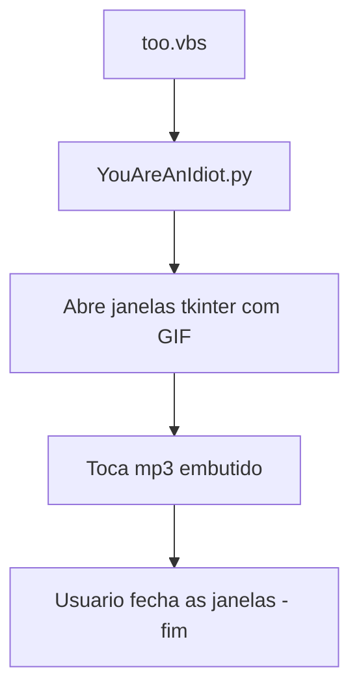

# 🤣 You-are-an-idiot.py — Prank Clássica (Consensual)
<p align="center">
  
  <a href="https://github.com/panda12332145/You-are-an-idiot.py/commits/main"></a>
  <a href="https://github.com/panda12332145/You-are-an-idiot.py"></a>
  
</p>
---
## ⚠️ Aviso Legal / Uso Ético

> **Prank (piada) — apenas com consentimento** e em máquinas sob o seu controle. Abrir janelas/sons no computador de outra pessoa sem autorização pode violar leis de acesso indevido e é uma péssima ideia. Use para estudar `tkinter`, `webbrowser` e VBS — nada além disso.

---
## 🔖 Resumo

Reimplementação da piada clássica **'You are an idiot'**: script Python com `tkinter` que abre janelas com GIF coreografado e áudio, mais um auxiliar em VBS — projeto de humor para estudo de GUI, carregamento de mídia e automação simples no Windows.

### ✨ Funcionalidades Principais

- ✅ Janelas `tkinter` com GIF animado
- ✅ Áudio embarcado tocado junto com a janela
- ✅ `too.vbs` — lançador em VBScript para Windows
- ✅ Tamanho minúsculo (1 arquivo + assets)

## 📽 Demonstração

```text
$ python YouAreAnIdiot.py
[  janela com GIF 'you are an idiot' + música tocando  ]
[  (feche com calma — é uma piada ;)  )  ]
```

## ⚙️ Explicação das Partes Importantes

### Janela GIF + áudio (`YouAreAnIdiot.py`)

```python
# carrega o GIF, abre a janela tkinter e
# reproduz you-are-an-idiot-idiot.mp3 em loop curto
```

> Demonstra como empacotar mídia ao lado do script e tocá-la com bibliotecas padrão.

### Lançador Windows (`too.vbs`)

```vbs
CreateObject("Wscript.Shell").Run "python YouAreAnIdiot.py"
```

> Atalho VBScript — usável como estudo de automação Windows.

## 🔄 Fluxo de Trabalho / Arquitetura



## 📂 Estrutura do Projeto

```plaintext
You-are-an-idiot.py/
├── you-are-an-idiot/
│   ├── YouAreAnIdiot.py                 # Script principal
│   ├── too.vbs                          # Lançador VBS
│   ├── you-are-an-idiot-idiot.gif       # Animação
│   └── you-are-an-idiot-idiot.mp3       # Áudio
└── README.md
```

## 🛠️ Tecnologias

| Ferramenta | Uso |
|---|---|
| **Python 3** | Linguagem |
| **tkinter** | Janelas/GIF |
| **VBScript** | Lançador Windows |

## ▶️ Instalação

```bash
git clone https://github.com/panda12332145/You-are-an-idiot.py.git
cd You-are-an-idiot.py/you-are-an-idiot
```

## 🚀 Execução

```bash
python YouAreAnIdiot.py
# Windows alternativo: clique duplo em too.vbs
```

## ⚠️ Limitações

- Só use com consentimento!
- Assets pesados (gif ~1MB) versionados
- Windows-first

## 🚀 Roadmap

- [ ] Botão de saída discreto (versão amigável)
- [ ] Arg --jokes para variar a animação

## 📄 Licença

Todos os direitos reservados ao autor.

---

## 👾 Autor

<p align="center">
  
</p>

<p align="center">Feito por <strong>Panda12332145</strong> 👋🏽</p>

---

## 🧑‍💻 Sobre Mim

Sou apaixonado por **Física Teórica, Cibersegurança e Desenvolvimento de Sistemas**. Tenho grande interesse em programação de baixo nível, engenharia reversa, automação, sistemas Windows, criptografia e segurança ofensiva. Também gosto bastante de música, filosofia e computação avançada.

---

## 🌐 Redes

* **Site:** [https://panda-h0me.netlify.app/](https://panda-h0me.netlify.app/)
* **YouTube:** [https://www.youtube.com/@X86BinaryGhost](https://www.youtube.com/@X86BinaryGhost)
* **Instagram:** [https://www.instagram.com/01pandal10/](https://www.instagram.com/01pandal10/)
* **GitHub:** [https://github.com/panda12332145](https://github.com/panda12332145)
* **LinkedIn:** [linkedin.com/in/athos-da-boanergis](https://www.linkedin.com/in/athos-d%C3%A3-boanergis-5585a4288/)

---

## 🚀 Áreas de Interesse

* **Cibersegurança Avançada** 🔒
* **Hacking & Engenharia Reversa** 💻
* **Computação de Baixo Nível** 🖥️
* **Matemática e Física Teórica** 📐⚛️
* **Desenvolvimento de Ferramentas de Segurança** 🛠️

_"Conhecimento é poder, e domínio técnico vem da compreensão profunda dos sistemas."_

---

## 📞 Contato & Suporte

Para colaborações, dúvidas ou sugestões:

📧 **E-mail:** [athos.cybersec@gmail.com](mailto:athos.cybersec@gmail.com)

🐛 **Reportar Bug:** [Abrir Issue](https://github.com/panda12332145/You-are-an-idiot.py/issues)

💡 **Sugerir Melhoria:** [Discussions](https://github.com/panda12332145/You-are-an-idiot.py/discussions)
